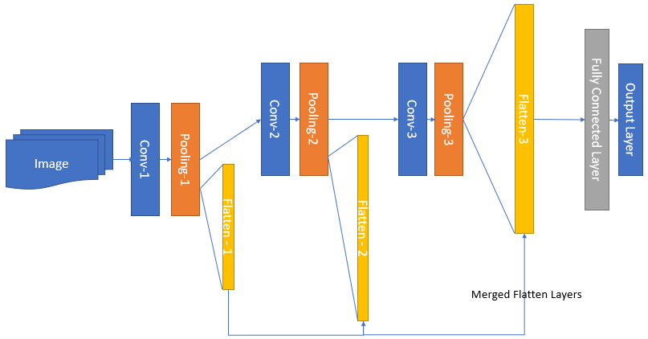

# Multi-Layer-Features-for-CNN-classifier-
Impact of each convolutional layer on the classification accuracy. 

In CNN, the convolutional layers are supposed to extract features from a given image wheras the dense layers will use those features to classify those images to certain clasess.The first layers in CNN extract low level fetaures like edges where the last layers in the convolution will extract high level features like certain shapes in the image. Any of this features will be used to differentiate images of different classes. 

Usually the flatten layer that is used to generate a 1D vector of those feature vectors at the last layer, will be used as an input to the dense layers that perform the classification task. In this experiment I have shown the difference in model accuracy by flattening feature maps at each layer of the CNN and providing that into the classification layer. This is by merging all the flatten layers at the end of each convolution into a single vector.

Here is a high level architecture showing how the featuremaps are merged together and fed to the fully connected layer. 

Thanks to tensorflow, I have used the cat and dog classification model and dataset to demonestrate this idea of using both low level and high level features for classification. Merging the feature vectors at each layers I have found a significant change on the accuracy of the model. Below is a plot showwing the accuracy of the original script on [tensorflow](https://www.tensorflow.org/tutorials/images/classification) and the modified version. 

